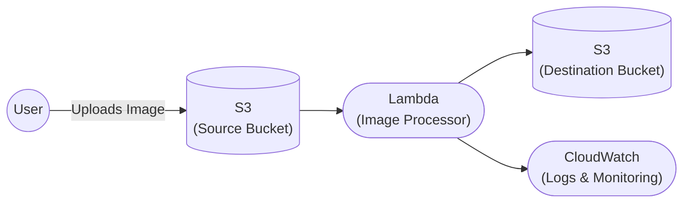

# Automated Image Processing System

An event-driven, serverless image processing system where S3 object creation events automatically trigger a Lambda function to optimize uploaded images and store the processed image in another S3 bucket. Whenever a user uploads an image, that event triggers Lambda, which resizes and compresses it using Pillow, then stores the output in a separate bucket with CloudWatch monitoring the executions.

## Architecture



## AWS Services Used
- S3 - to store the raw and processed images
- Lambda - to run the image processing code automatically
- IAM - to give Lambda only the permissions it actually needs
- CloudWatch - to check logs and monitor the function

## How It Works
1. User uploads an image to an S3 bucket (source bucket)
2. This upload automatically triggers a Lambda function (using S3 event notification)
3. The Lambda function uses the Pillow library to resize the image to 800px width and compress it
4. The processed image is saved into another S3 bucket (destination bucket)
5. CloudWatch keeps logs of everything so I can check if it worked or if something failed

## Setup
1. Create two S3 buckets (source and destination)
2. Create an IAM role for Lambda with scoped access to both buckets (see `iam-policy.json`)
3. Package Pillow as a Lambda Layer and attach it to the function
4. Create the Lambda function, set `DESTINATION_BUCKET` as an environment variable
5. Add an S3 event notification on the source bucket, pointing to the Lambda function
6. Add a lifecycle rule on the source bucket to delete old raw images
7. Upload a test image to confirm it works

### Packaging the Pillow Layer

```bash
pip install pillow -t pillow_layer/python --platform manylinux2014_x86_64 --only-binary=:all:
cd pillow_layer && zip -r pillow_layer.zip python
```
